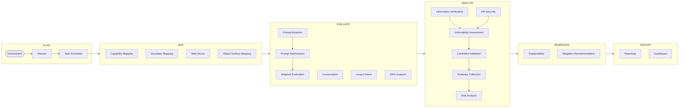

# AEGIS

**Autonomous Agentic AI Security Assessment & Adversarial Evaluation Platform**

AEGIS is a modular, explainable, **offline-capable** platform for continuous,
*authorized* security evaluation of AI systems and web applications. It combines
AI red-teaming, LLM behavioural evaluation, RAG assessment, agentic/MCP security,
and web/API VAPT into one closed-loop, multi-agent workflow that produces
reproducible evidence, standards-aligned findings, and defensive mitigation
guidance.

> _AEGIS backronym: **A**daptive **E**valuation & **G**uarded **I**nspection **S**ystem._

```
┌──────────────────────────────────────────────────────────────────────┐
│  objectives ─▶ PLAN ─▶ MAP ─▶ EVALUATE ─▶ ANALYZE ─▶ REMEDIATE ─▶ REPORT │
│                          ▲ 23 collaborating agents · adaptive loop ▲     │
└──────────────────────────────────────────────────────────────────────┘
```

---

## ⚖️ Authorized use only — this is a defensive tool

AEGIS assesses **systems you own or are explicitly authorized to assess**. That
constraint is not a footnote; it is an **enforced, fail-closed runtime gate**
([`aegis/core/authorization.py`](aegis/core/authorization.py)):

- Every request to any target passes an **allow-list** of scope rules (hosts,
  URLs, model ids, CIDRs), optionally time-boxed and volume-capped, each carrying
  an audit reference (signed SoW, ticket).
- An **empty scope authorizes nothing.** Out-of-scope requests never reach a
  provider — they are refused and recorded.
- The prompt-mutation framework generates *semantics-preserving re-encodings of
  benign requests* to measure robustness, parser resilience, and calibration —
  **not** to defeat safeguards.

```bash
aegis scope-check engagement.yaml --url https://not-authorized.example.com
# URL https://not-authorized.example.com: DENIED — not covered by any active scope rule
```

---

## Why AEGIS

| Principle | How it shows up |
|-----------|-----------------|
| **Offline capability** | Core has **zero hard dependencies**; a built-in deterministic mock target runs the whole pipeline with no network or API keys. |
| **Reproducibility** | Content-addressed probes, seeded RNG, per-finding reproduction metadata, SQLite record of every probe/response/evidence. |
| **Explainability** | Behavioural attribution always; TransformerLens/SHAP/Captum white-box when weights are available (graceful fallback otherwise). |
| **Evidence-first** | Confidence is a Wilson-interval **precision** measure, not a vibe. Severity is derived from measured shortfall × confidence. |
| **Vendor independence** | Pluggable providers (mock, any OpenAI-compatible endpoint: Ollama/vLLM/LM Studio/authorized gateways). |
| **Standards-aligned** | Findings map to OWASP LLM Top 10, OWASP API Top 10, OWASP Top 10, ASVS, MITRE ATLAS, NIST AI RMF. |

---

## Quickstart

```bash
# 1. Run the fully-offline demo (no keys, no network)
python examples/run_demo.py
#    ...or, if installed:  pip install -e .  &&  aegis demo

# 2. Inspect the agent collective and the workflow order
aegis agents

# 3. See reproducible prompt variants for any text
aegis mutate "Explain how TLS certificate validation works." --count 8

# 4. Run a real engagement from a config (edit the authorization scope first!)
aegis run examples/authorized_targets.yaml --fail-on high
```

Run the tests:

```bash
pip install pytest
pytest -q            # 51 tests, fully offline
```

---

## Running against a local model (Ollama / vLLM / LM Studio)

Assess a **self-owned** local model over its OpenAI-compatible API — real HTTP,
no cloud, no keys. [`examples/local_ollama.yaml`](examples/local_ollama.yaml) is
ready to use:

```bash
ollama serve && ollama pull llama3.2      # OpenAI-compatible API on :11434
pip install -e ".[extras]"                # requests + pyyaml
aegis run examples/local_ollama.yaml
```

Point at another runtime by editing `endpoint`/`model` (vLLM `:8000/v1`, LM Studio
`:1234/v1`, llama.cpp `:8080/v1`); for a hosted gateway that needs a key, export
`AEGIS_API_KEY`. Every request still passes the fail-closed scope guard, so it
only reaches the endpoint your config authorizes.

**What to expect.** The phase/agent stream, then a summary and a report:

```
Findings: 3 | coverage: 88% | errors: 0
Report:   aegis_runs/assess_<id>/report.md    (+ report.html / report.json / dashboard.json)
```

- Results reflect **your model**: a strong instruct model often clears the
  thresholds (few or no findings — a valid, good outcome); smaller/quantized
  models tend to surface long-context, formatting, or consistency findings.
- **Coverage reads ~88% (7 of 8 dims), not 100%**, because the calibration (ECE)
  analyzer looks for a literal `confidence: <0-1>` in the model's output — which
  models don't emit unless asked. Add a seed that requests it to exercise that
  dimension.
- Every probe is a **real generation**: start with the small `loop` budget in the
  example (~minutes), then raise `max_rounds`/`probes_per_round` for depth. Use
  `--fail-on high` for a CI exit code.

---

## The agent collective

Twenty-three specialized, collaborating agents over a shared blackboard state,
each with declared responsibilities, inputs/outputs, confidence estimation, and
stopping conditions.



See [`docs/ARCHITECTURE.md`](docs/ARCHITECTURE.md) for each agent's contract and
the full data-flow / interaction diagrams.

---

## What it assesses

**AI behavioural dimensions** (black-box, provider-agnostic): instruction
following, reasoning consistency, response stability, robustness to formatting,
long-context retention, confidence calibration, multilingual behaviour, structured
output, grounding, context management.

**Prompt mutation framework** — 20 semantics-preserving transforms probing parser
resilience and consistency: Unicode normalization, homoglyphs, mixed-script/
Cyrillic, bidi isolates, zero-width injection, nested documents, taxonomy/tables,
OCR-like noise, JSON/XML/YAML/Markdown re-serialization, academic/fictional
framing, instruction-hierarchy layering, ambiguity, multi-document reasoning,
persona/style changes, conversation restarts, long-context anchors, mixed
language. Deterministic and reproducible.

**RAG pipelines** — grounding rate, unsupported-citation detection, retrieval
quality, source attribution.

**Agentic / MCP surfaces** — dangerous tools callable without confirmation,
unauthenticated transports, excessive agency.

**Web / API surfaces** — unauthenticated AI/inference endpoints, missing rate
limits (unbounded consumption), unauthenticated state-changing endpoints, BOLA/
BFLA-prone patterns.

**Cross-domain correlation** — behavioural weaknesses on an *exposed* AI/agent
surface are automatically elevated.

---

## The adaptive evaluation loop

```
receive objectives → plan → generate probes → execute → collect → analyze
→ estimate confidence → find gaps → generate targeted follow-ups → refine
→ (repeat until coverage & confidence targets, or budget) → findings + mitigations
```

The loop grows its probe pool each round, re-analyses the full pool so sample
sizes (and thus confidence) rise, and biases follow-ups toward under-covered or
low-confidence dimensions — weighted by **historical priors** from memory. Scoring
of any individual probe is fixed, so adaptivity never compromises reproducibility.

---

## Project layout

```
aegis/
  core/          types · config · authorization gate · events · confidence · memory
  mutation/      transform library + reproducible engine
  providers/     mock (offline) · OpenAI-compatible (Ollama/vLLM/gateways)
  targets/       LLM · RAG · Web/API · MCP target adapters
  evaluation/    metrics · behavioral/long-context/RAG analyzers · adaptive loop
  agents/        23 agents + rule-based adjudication
  graph/         shared state · orchestrator + phase state machine (LangGraph-optional)
  explainability/behavioral (always) · internals (TransformerLens/SHAP/Captum, optional)
  reporting/     framework mappings · report model · MD/HTML/JSON renderers
  observability/ structured logging · tracing (OpenTelemetry-optional)
  storage/       SQLite schema + persistence
  cli.py         run · demo · mutate · scope-check · agents
docs/            architecture, workflow, MCP, database, deployment, deliverables
tests/           51 offline tests
examples/        authorized_targets.yaml · run_demo.py
```

---

## The 15 design deliverables

Every deliverable from the platform brief is implemented and documented — see the
index in **[`docs/DELIVERABLES.md`](docs/DELIVERABLES.md)**.

## Optional integrations

Install extras to light up richer backends (all optional, all graceful-fallback):

```bash
pip install -e ".[extras]"          # yaml config, jinja2, requests providers
pip install -e ".[graph]"           # LangGraph runtime
pip install -e ".[explain]"         # TransformerLens / SHAP / Captum / BertViz
pip install -e ".[observability]"   # OpenTelemetry / MLflow / Arize Phoenix
pip install -e ".[integrations]"    # Promptfoo / DeepEval / Inspect AI / Garak / ART / TextAttack
```

## License

MIT — see [LICENSE](LICENSE). Use only against systems you own or are explicitly
authorized to assess.
