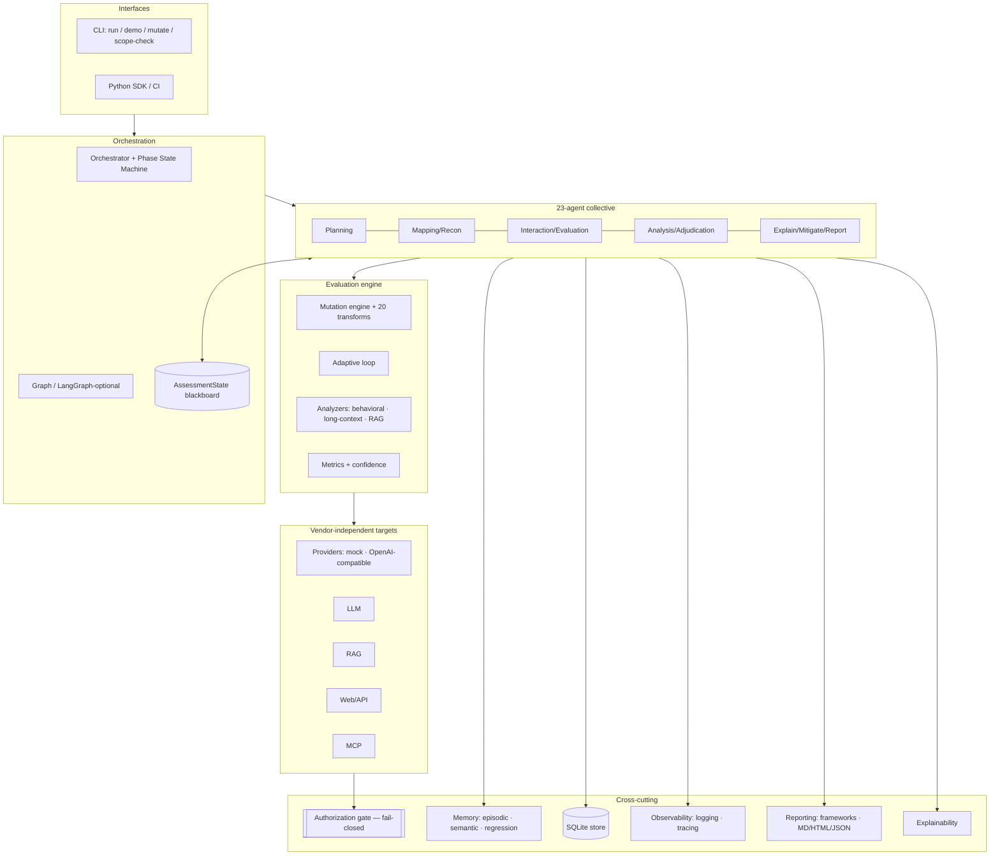
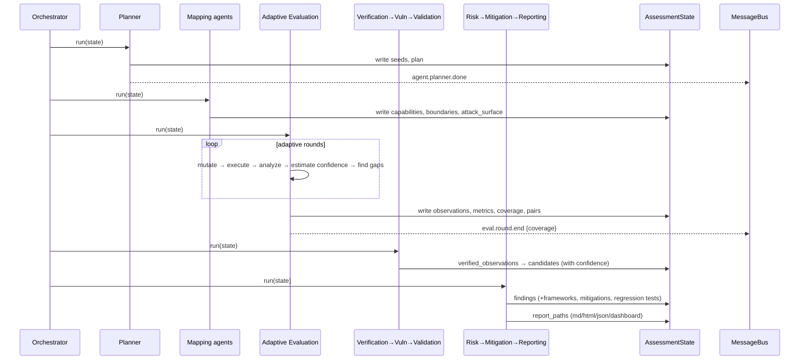
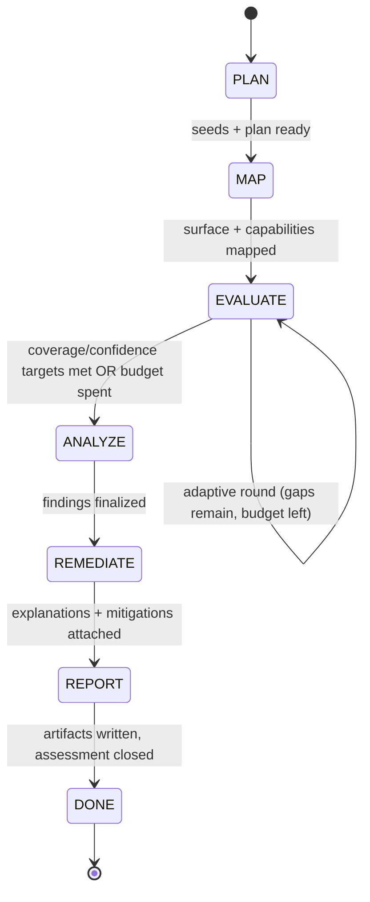
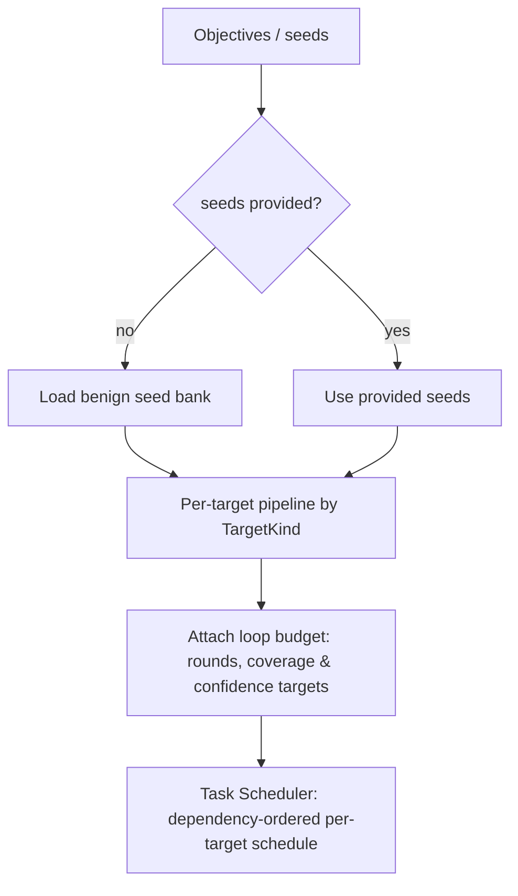
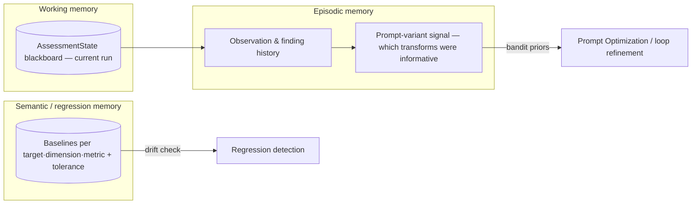
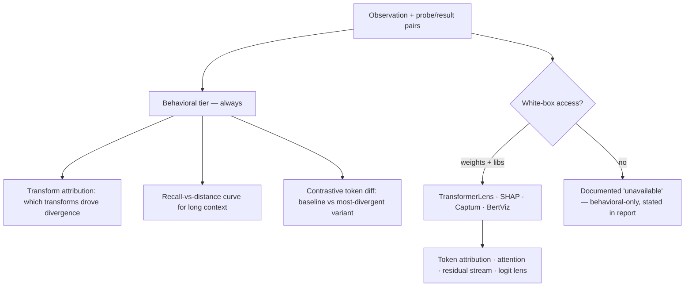
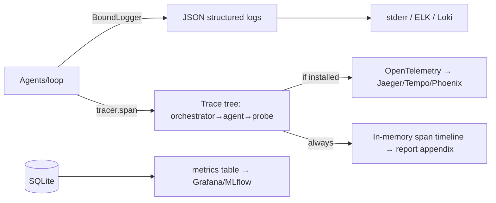
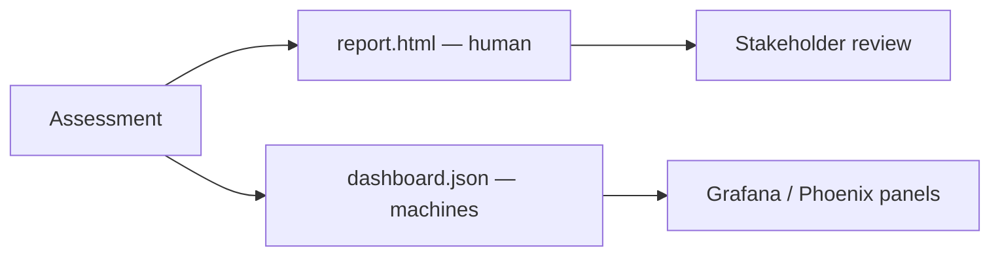

# AEGIS Architecture

This document covers the system architecture, the multi-agent interaction model,
the state machine, planner logic, memory architecture, explainability integration,
evaluation metrics, observability, and dashboard design. (Workflow/LangGraph, MCP,
database, and deployment have dedicated docs.)

---

## 1. System architecture

AEGIS is layered so that each concern is independently testable and swappable.
The **core is pure standard library** (offline, deterministic); every heavier
integration is optional and runtime-detected.

**Design principles in practice**

- *Modularity* — agents/analyzers/providers/transforms are registries; add one
  without touching the rest.
- *Reproducibility* — content-addressed probes + seeded RNG + SQLite record.
- *Observability* — structured logs + spans around every agent and probe.
- *Vendor independence* — the analyzers read only response text; any provider works.
- *Security by design* — the authorization gate is on the request path, fail-closed.

---

## 2. Multi-agent interaction

Agents collaborate two ways: **directly** via declared read/write keys on the
shared `AssessmentState` blackboard, and **indirectly** via typed `Message`
events on an in-process bus (audit trail + loose coupling).

### The 23 agents

| # | Agent | Phase | Responsibility |
|---|-------|-------|----------------|
| 0 | Orchestrator | — | Coordinate the collective across phases; enforce ordering |
| 1 | Planner | plan | Objectives → seed bank, per-target pipeline, budget |
| 2 | Task Scheduler | plan | Dependency-ordered, per-target schedule |
| 3 | Capability Mapping | map | Responsiveness, instruction-following, structured output |
| 4 | Boundary Mapping | map | Empty/oversized input, format adherence |
| 5 | Web Recon | map | Enumerate/classify declared web/API surface |
| 6 | Attack-Surface Mapping | map | Consolidate cross-target surface inventory |
| 7 | Prompt Mutation | evaluate | Own the transform catalog + reproducible generation |
| 8 | Prompt Optimization | evaluate | Prioritize transforms via historical priors (bandit) |
| 9 | Conversation | evaluate | Multi-turn context-management probe |
| 10 | Adaptive Evaluation | evaluate | Closed-loop evaluator; persist probes/observations |
| 11 | Long-Context | evaluate | Systematic recall-vs-distance sweep |
| 12 | RAG Analysis | evaluate | Grounding, citation, retrieval quality |
| 13 | Information Verification | analyze | Corroborate/aggregate; flag thin data |
| 14 | API Security | analyze | OWASP API Top 10 / excessive-agency surface checks |
| 15 | Vulnerability Assessment | analyze | Observations → candidate findings (thresholds) |
| 16 | Controlled Validation | analyze | Safe, authorized confirmatory re-test |
| 17 | Evidence Collection | analyze | Reproduction-grade evidence per finding |
| 18 | Risk Analysis | analyze | Finalize severity; cross-domain correlation |
| 19 | Explainability | remediate | Behavioral + white-box-optional explanations |
| 20 | Mitigation Recommendation | remediate | Frameworks + mitigations + regression tests |
| 21 | Reporting | report | Assemble + render MD/HTML/JSON; persist |
| 22 | Dashboard | report | Machine-readable coverage/metric time-series |

Each agent extends `BaseAgent`, whose lifecycle wraps `_run` with tracing,
logging, bus events, confidence estimation, and a `should_run` **stopping/gating
condition** (e.g. API Security only runs when a web/MCP surface exists).

---

## 3. State machine

The Orchestrator advances through six phases (plus a terminal `DONE`). Agents are
mapped to phases; the phase view drives progress reporting and the report's
methodology section.

Within `EVALUATE`, the **Adaptive Evaluation** agent runs its own inner loop
(round → analyze → gaps → refine) until `LoopConfig` stopping conditions —
`min_rounds`, `coverage_target`, `confidence_target`, `max_rounds` — are met.

---

## 4. Planner logic

The Planner is deterministic and transparent: it selects a **pipeline per target
kind** (e.g. LLM → capability→boundary→mutation→optimization→conversation→adaptive
→long-context→explainability; MCP → attack-surface→api-security) plus a shared
adjudication tail (verify→vuln→validate→evidence→risk→mitigate). The scheduler
materializes an explicit per-target schedule for the report.

---

## 5. Memory architecture

Three tiers, all SQLite-backed so they persist and keep runs reproducible:

- **Working** — the live blackboard for the current assessment.
- **Episodic** — what happened, and which prompt variants produced signal.
  `transform_priors()` returns Laplace-smoothed hit-rates that bias future
  transform selection (learning *which* probes to prioritize).
- **Semantic/regression** — accepted baselines per `(target_key, dimension,
  metric)` with a tolerance; `check_regression()` flags drift across runs. This is
  the backbone of continuous validation.

Priors change *which* probes run; they never change *how* a probe is scored — so
learning and reproducibility coexist.

---

## 6. Explainability integration

The **behavioral tier is provider-agnostic** and always runs. The **internals
tier** activates only in genuine white-box engagements (weights local + libraries
installed); otherwise the report honestly records that internals were unavailable
and exactly what *would* have been produced with access.

---

## 7. Evaluation metrics

All metrics are pure functions (see [`aegis/evaluation/metrics.py`](../aegis/evaluation/metrics.py)).

| Metric | Meaning | Direction |
|--------|---------|-----------|
| `consistency` | mean pairwise cosine similarity across variant answers | higher better |
| `stability` (per family) | 1 − divergence-rate vs identity baseline | higher better |
| `anchor_recall_rate` | long-context / multi-turn recall of an injected token | higher better |
| `ece` / `brier` | calibration of stated confidence vs correctness | lower better |
| `grounding_rate` | fraction of RAG answers whose citations are all retrieved | higher better |
| `avg_top_retrieval_score` | mean top-1 retrieval relevance | higher better |
| `conflict_acknowledgement_rate` | surfacing of layered-instruction conflicts | higher better |
| coverage | fraction of **measurable** dimensions observed | higher better |

**Confidence is precision, not magnitude.** `measurement_confidence(value, n)` =
`1 − width(Wilson 95% CI)`, so a confidently-*poor* result (value 0.0 over many
trials) is *high* confidence. Severity = f(shortfall vs threshold) discounted when
the measurement itself is low-confidence.

---

## 8. Logging & observability

Every log record can carry `assessment_id`/`agent`/`event` for correlation. Spans
wrap every agent and probe; with OpenTelemetry installed they export to a real
backend, otherwise an in-memory timeline is embedded in the report.

---

## 9. Dashboard design

Two complementary surfaces:

- **`report.html`** — a self-contained, theme-aware dashboard (risk cards,
  AI/web/MCP finding tables, metrics, coverage). No external assets; opens
  anywhere, shareable.
- **`dashboard.json`** — machine-readable coverage/confidence **time-series per
  round** and metric snapshot, for external dashboards (Grafana, Arize Phoenix).

Dashboard schema (`dashboard.json`): `{engagement, assessment_id, coverage,
metrics, rounds:{target:[{round,coverage,mean_confidence,probes,gaps}]},
finding_counts}`.
