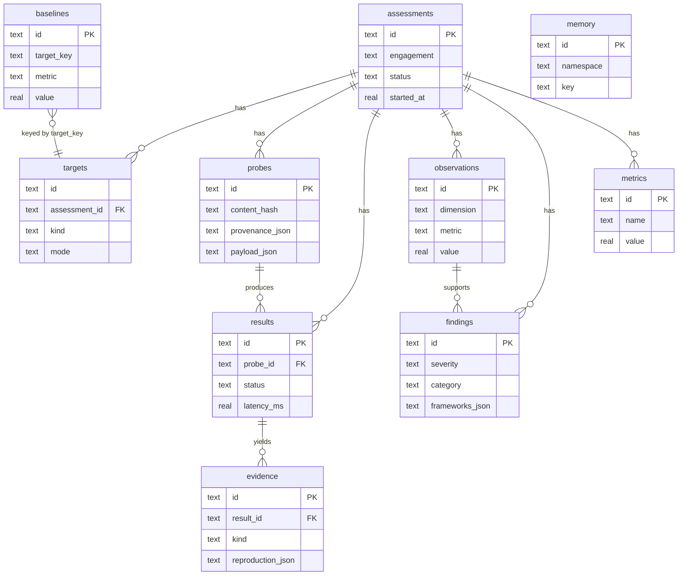

# Database Schema

AEGIS persists every assessment to SQLite (`aegis/storage/schema.sql`), so any run
is fully reconstructable — raw probes and responses, derived observations,
adjudicated findings, metrics, and the memory/regression baselines that power
continuous validation. The schema is written to port cleanly to PostgreSQL for
multi-user deployments (swap `Database` internals; DDL is near-portable).

---

## Entity relationships

---

## Tables

| Table | Purpose | Key columns |
|-------|---------|-------------|
| `assessments` | one row per engagement run | `id`, `engagement`, `status`, `config_json`, timing |
| `targets` | targets in an assessment | `(assessment_id,id)`, `kind`, `mode`, `model`, `endpoint` |
| `probes` | every planned interaction | `id`, `content_hash`, `provenance_json`, `payload_json` |
| `results` | responses to probes | `id`, `probe_id`, `status`, `response_json`, `latency_ms`, `tokens_json` |
| `evidence` | replayable artifacts | `id`, `kind`, `payload_json`, `reproduction_json` |
| `observations` | measured behaviours | `dimension`, `metric`, `value`, `confidence_json`, `evidence_ids_json` |
| `findings` | adjudicated conclusions | `severity`, `category`, `frameworks_json`, `mitigations_json`, `regression_tests_json` |
| `metrics` | metric snapshots | `name`, `value`, `target_id` |
| `memory` | episodic KV (variant signal, notes) | `namespace`, `key`, `value_json` |
| `baselines` | regression baselines | unique `(target_key,dimension,metric)`, `value`, `tolerance` |

**Reproducibility columns.** `probes.content_hash` de-duplicates and identifies a
probe by its visible payload; `evidence.reproduction_json` carries
`{provider, model, prompt_hash, provenance, params}` — enough to replay the exact
interaction. `findings.*_json` are self-contained so a report renders from the DB
alone.

---

## Retention & scale

- SQLite in WAL mode is the default (single-node, offline, portable file).
- For fleet/continuous use, point `Database` at PostgreSQL: the DDL uses only
  portable types; `INSERT ... ON CONFLICT` is already Postgres-compatible.
- Prune old assessments by `started_at`; `ON DELETE CASCADE` cleans dependents.
- The `metrics` and `baselines` tables are the integration point for external
  time-series dashboards and drift alerts.
