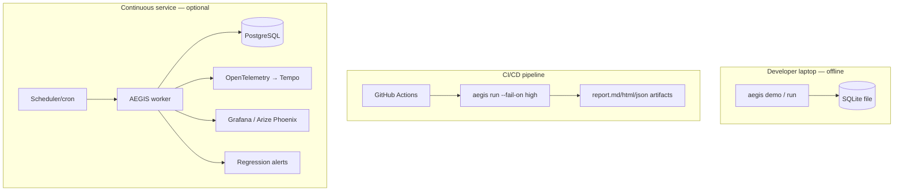
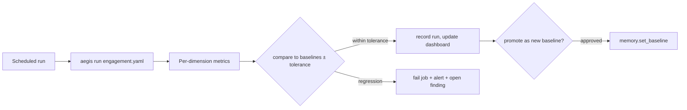

# Deployment, CI/CD & Continuous Validation

Covers deliverables 13 (CI/CD integration), 14 (continuous validation workflow),
and 15 (deployment recommendations).

---

## Deployment topologies



**Recommendations**

| Scale | Store | Runtime | Notes |
|-------|-------|---------|-------|
| Ad-hoc / dev | SQLite file | CLI / `python -m` | Zero deps; fully offline. |
| CI gate | SQLite (ephemeral) | GitHub Actions job | Upload reports as artifacts; `--fail-on`. |
| Continuous | PostgreSQL | Container + scheduler | Baselines persist; drift alerts; dashboards. |
| Fleet | PostgreSQL + object store | K8s workers + queue | One worker per engagement; OTel tracing. |

- **Secrets**: real providers read the API key from an env var
  (`AEGIS_API_KEY`); never commit keys. The mock needs none.
- **Network**: default posture is offline. Real endpoints require an explicit,
  in-scope authorization rule; there is no way to reach an unlisted target.
- **Isolation**: run assessment workers with least privilege and egress limited
  to authorized target hosts.

---

## Containerization

```bash
docker build -t aegis:latest .
docker run --rm -v "$PWD/out:/work/aegis_runs" aegis:latest demo

# Run an engagement (mount your config; edit its authorization scope first)
docker run --rm \
  -v "$PWD/engagement.yaml:/work/engagement.yaml:ro" \
  -v "$PWD/out:/work/aegis_runs" \
  aegis:latest run /work/engagement.yaml --fail-on high
```

`docker-compose.yml` additionally wires an optional PostgreSQL for continuous mode.

---

## CI/CD integration (deliverable 13)

`.github/workflows/ci.yml` runs on every push/PR:

1. **Lint** (ruff) + **compile** all modules.
2. **Test** (`pytest`, 48 offline tests) on Python 3.10–3.12.
3. **Smoke** the offline demo and assert a report is produced.
4. **Package** the Markdown/HTML/JSON report as a build artifact.

Add AEGIS as a **security gate** in your own app's pipeline:

```yaml
- name: AEGIS AI security gate
  run: |
    pip install -e .
    aegis run engagement.yaml --fail-on high   # non-zero exit blocks the merge
- uses: actions/upload-artifact@v4
  with: { name: aegis-report, path: aegis_runs/**/report.* }
```

---

## Continuous validation (deliverable 14)

The continuous-validation workflow turns AEGIS into a **regression tripwire** for
AI behaviour, using the semantic/regression memory tier.



**How it works**

1. First run seeds baselines: `Memory.learn_baselines(report.observations)`.
2. Each subsequent run computes the same metrics and calls
   `Memory.check_regression(dimension, metric, current)`.
3. A drop beyond `tolerance` on a higher-is-better metric (or a rise on ECE) is a
   **regression** → the job fails and an alert/finding is raised.
4. Baselines are promoted deliberately (human-approved), so intended improvements
   become the new floor.

`.github/workflows/continuous-validation.yml` schedules this (e.g. nightly) and is
also the template for a service-mode scheduler. Because probe scoring is
deterministic, a regression reflects a *real* behavioural change in the target,
not evaluation noise.

---

## Observability wiring

- **Logs**: JSON to stderr → ship to ELK/Loki. Records carry `assessment_id`.
- **Traces**: install `[observability]` extras → spans export via OpenTelemetry to
  Jaeger/Tempo/Arize Phoenix. Without it, an in-memory span timeline is embedded
  in the report.
- **Metrics/dashboards**: `metrics`/`baselines` tables + `dashboard.json` feed
  Grafana/Phoenix; `report.html` is a standalone stakeholder dashboard.
