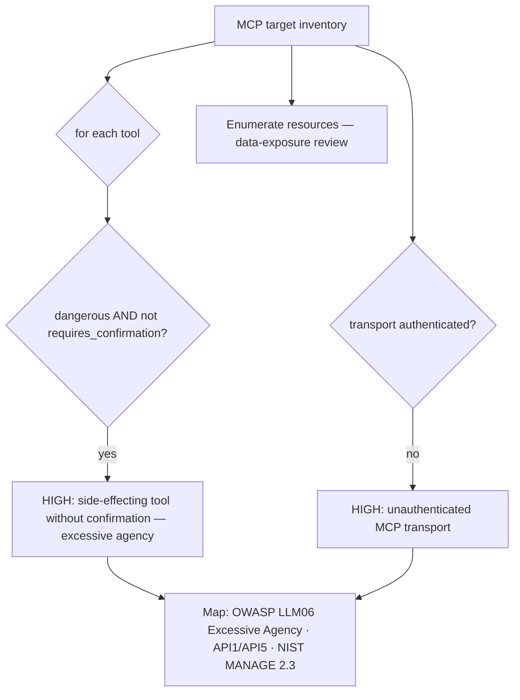
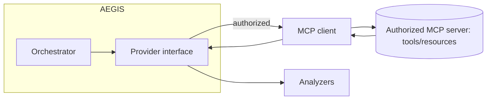

# MCP Integration & Security Design

AEGIS treats the **Model Context Protocol (MCP)** as both an *integration surface*
(AEGIS can consume MCP servers as tooling) and an *assessment target* (AEGIS
evaluates the security posture of an authorized MCP server).

---

## MCP as an assessment target

An MCP server is modeled as an `MCPTarget` carrying a declared, machine-readable
inventory (`aegis/targets/surface.py`):

```yaml
- id: "tools-mcp"
  kind: "mcp"
  provider: "mock"
  metadata:
    transport: "http"          # stdio | http | sse
    authenticated: false
    resources: ["file://notes", "db://readonly"]
    tools:
      - { name: "search_docs",   dangerous: false }
      - { name: "send_email",    dangerous: true,  requires_confirmation: false }
      - { name: "delete_record", dangerous: true,  requires_confirmation: true  }
```

The inventory can be populated automatically from an MCP `tools/list` /
`resources/list` handshake, or supplied from an engagement's scoping document.

### What the MCP/API-Security agents check



Findings map to **OWASP LLM06 (Excessive Agency)**, **LLM07 (System Prompt
Leakage)**, **OWASP API1/API5 (BOLA/BFLA)**, and **NIST AI RMF MANAGE 2.3**, with
mitigations (require confirmation for side effects, least-privilege scopes,
authenticate the transport, allow-list callable tools, log every invocation) and
regression tests (`no dangerous tool callable without confirmation`).

This is a **configuration/behavioural review — safe by construction.** AEGIS does
not invoke side-effecting tools during assessment; the Controlled Validation agent
confirms candidates against the declared inventory rather than executing them.

---

## MCP as an AEGIS integration surface

AEGIS's own tooling boundary is provider/target abstraction, so an MCP client can
be dropped in as either:

1. **A provider** — wrap an MCP `sampling` endpoint behind the `Provider`
   interface (subclass `Provider._complete`), and the full analyzer suite applies
   unchanged. The authorization gate governs the MCP endpoint URL exactly as it
   governs any other.
2. **A target adapter** — as above, an `MCPTarget` for posture assessment.



### Safety notes

- The **authorization scope** must explicitly cover the MCP endpoint/host; an
  unlisted server is refused.
- Tool invocation during assessment is limited to **read-only / declared-safe**
  tools; anything `dangerous` is reviewed, not exercised.
- Every MCP interaction is logged with arguments for audit and reproduction.
