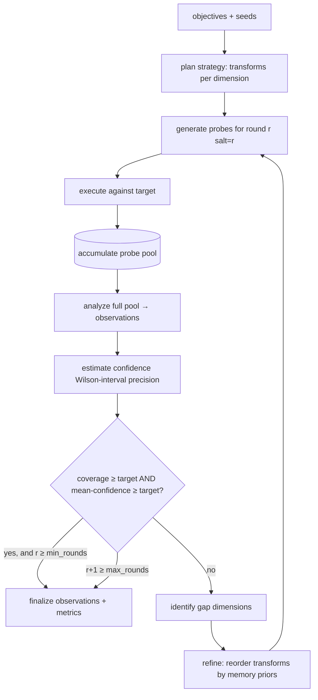

```mermaid
flowchart LR
    START((start)) --> planner --> task_scheduler
    task_scheduler --> capability_mapping --> boundary_mapping
    boundary_mapping --> web_recon --> attack_surface_mapping
    attack_surface_mapping --> prompt_mutation --> prompt_optimization
    prompt_optimization --> conversation --> adaptive_evaluation
    adaptive_evaluation --> long_context --> rag_analysis
    rag_analysis --> information_verification --> api_security
    api_security --> vulnerability_assessment --> controlled_validation
    controlled_validation --> evidence_collection --> risk_analysis
    risk_analysis --> explainability --> mitigation_recommendation
    mitigation_recommendation --> reporting --> dashboard --> DONE((done))
```

# Workflow & LangGraph Integration

AEGIS ships a **deterministic, dependency-free workflow runner** as the reference
implementation, and an **optional LangGraph adapter** for teams standardizing on
that runtime. Both execute the same 23-agent collective in the same
dependency-respecting order; AEGIS's adaptivity lives *inside* the Adaptive
Evaluation node, so a linear top-level graph is faithful.

---

## Reference runner (built-in, no dependencies)

`aegis.graph.workflow.Orchestrator` iterates `WORKFLOW_ORDER`, advancing the phase
state machine and publishing lifecycle events. One shared `AssessmentState` flows
through; each agent's `should_run` gates it per target kind.

```python
from aegis.core.config import Config
from aegis.graph import run_assessment

cfg = Config.load("engagement.yaml")
state = run_assessment(cfg, progress=lambda k, d: print(k, d))
print(len(state.findings), state.report_paths["markdown"])
```



---

## LangGraph adapter (optional)

```python
from aegis.core.config import Config
from aegis.graph import to_langgraph          # requires: pip install aegis-ai-security[graph]

app = to_langgraph(Config.load("engagement.yaml"))
# app is a compiled langgraph StateGraph with one node per agent, wired START→…→END
```

`to_langgraph` builds a `StateGraph` whose nodes wrap each agent's `run`. If
LangGraph is not installed it raises a clear, actionable error — the built-in
runner is always available.

**Why linear at the top level?** The agent order encodes hard data dependencies
(you cannot verify observations before you produce them). The *exploratory*
adaptivity — deciding which transforms to run next based on coverage/confidence
gaps and memory priors — is encapsulated in the Adaptive Evaluation agent's inner
loop, which is the correct altitude for a cyclic sub-graph.

---

## The adaptive inner loop



Key properties:

- **Pool accumulation** — every round adds fresh, salted (reproducible) variants;
  the whole pool is re-analyzed, so sample sizes and confidence grow.
- **Gap-directed** — follow-ups target under-covered / low-confidence dimensions.
- **Prior-weighted** — historically-informative transforms are tried first
  (bandit-style), shortening time-to-signal without changing scoring.
- **Bounded & deterministic** — `LoopConfig(min_rounds, max_rounds,
  coverage_target, confidence_target, seed)`; same inputs ⇒ same metrics.

---

## CI usage

```bash
aegis run engagement.yaml --fail-on high   # exit 1 if any finding ≥ high
```

The runner returns a populated `AssessmentState`; `report_paths` points at the
Markdown/HTML/JSON/dashboard artifacts, and every probe/response/evidence row is
in the SQLite store for independent replay.
