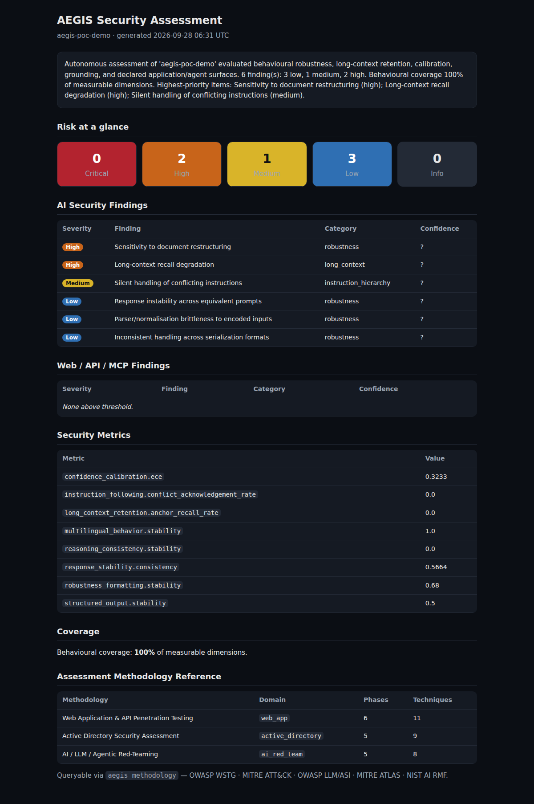
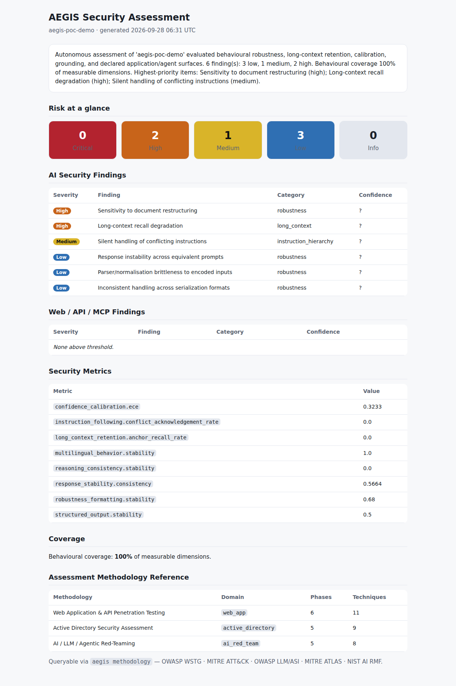

# AEGIS — Proof of Concept Report

**Methodology integration (Web Application Pentesting · Active Directory · AI Red-Teaming) + real-time platform run**

| | |
|---|---|
| **Run date/time** | `2026-09-28 06:31:16 UTC` → `2026-09-28 06:31:20 UTC` |
| **Assessment window** | started `2026-09-28 06:31:16 UTC`, finished `2026-09-28 06:31:17 UTC` |
| **Host** | `Linux-6.18.44-fc-v37-x86_64-with-glibc2.39` |
| **Python** | `3.11.15` |
| **AEGIS version** | `0.1.0` |
| **Engagement** | `aegis-poc-demo` |
| **Target** | Built-in **offline deterministic mock target** (no network, no API keys) |
| **Result** | 6 findings · **100%** behavioural coverage · **0** errors · **63/63** tests passing |

> **Scope & authorization statement.** This PoC exercises AEGIS end-to-end against
> its **built-in offline mock target** — the authorized, safe-by-construction path
> the platform is designed for. **No real, external, or unauthorized system was
> touched.** AEGIS's authorization gate is fail-closed (an empty scope authorizes
> nothing), so a live web/AD/AI target would run only against endpoints listed in a
> signed engagement scope. The evidence below therefore proves the *platform and
> the newly integrated methodology work as designed*, not the compromise of any
> real system. All timestamps are real, captured during the run.

---

## 1. What this PoC demonstrates

1. **New methodology knowledge base is integrated into the code** — three
   machine-readable, framework-mapped methodologies (Web Application & API
   pentesting, Active Directory security assessment, AI/LLM/agentic red-teaming),
   queryable via a new `aegis methodology` CLI command and appended to every
   generated report.
2. **The platform runs in real time** — a full 22-agent autonomous assessment
   against the mock target, producing Markdown/HTML/JSON reports and a dashboard.
3. **Everything is verified** — the offline test suite (63 tests, incl. 15 new
   methodology tests) passes, and the HTML dashboard is screenshotted below.

The AI red-team methodology integrates the phased model from
[requie/AI-Red-Teaming-Guide](https://github.com/requie/AI-Red-Teaming-Guide) and
the engagement-pipeline shape from
[samugit83/redamon](https://github.com/samugit83/redamon), re-expressed inside
AEGIS's authorization-gated, defensive model. See
[`docs/METHODOLOGY_AI_REDTEAM.md`](../METHODOLOGY_AI_REDTEAM.md).

---

## 2. Methodology knowledge base (the integration)

`$ aegis methodology`

```
AEGIS assessment methodologies:

  webapp             Web Application & API Penetration Testing
                     6 phases · 11 techniques · domain=web_app

  active-directory   Active Directory Security Assessment
                     5 phases · 9 techniques · domain=active_directory

  ai-redteam         AI / LLM / Agentic Red-Teaming
                     5 phases · 8 techniques · domain=ai_red_team
```

| Methodology | Phases | Techniques | Aligned frameworks |
|-------------|:------:|:----------:|--------------------|
| Web Application & API Penetration Testing | 6 | 11 | OWASP WSTG, OWASP Top 10, API Top 10, ASVS, PTES, MITRE ATT&CK |
| Active Directory Security Assessment | 5 | 9 | MITRE ATT&CK, MS *Securing AD* / tiering, CISA, NIST 800-53 |
| AI / LLM / Agentic Red-Teaming | 5 | 8 | OWASP LLM Top 10, OWASP Agentic (ASI), MITRE ATLAS, NIST AI RMF |
| **Total** | **16** | **28** | |

Full machine-readable export: [`methodology_export.json`](methodology_export.json).
Human-readable docs:
[Web App](../METHODOLOGY_WEBAPP.md) ·
[Active Directory](../METHODOLOGY_ACTIVE_DIRECTORY.md) ·
[AI Red-Team](../METHODOLOGY_AI_REDTEAM.md).

---

## 3. Real-time assessment run (evidence)

The autonomous workflow executed all phases against the mock target
(`plan → map → evaluate → analyze → remediate → report`):

```
[2026-09-28 06:31:16 UTC] assessment started: 2026-09-28 06:31:16 UTC
[2026-09-28 06:31:16 UTC]   phase -> plan
[2026-09-28 06:31:16 UTC]   phase -> map
[2026-09-28 06:31:16 UTC]   phase -> evaluate
[2026-09-28 06:31:17 UTC]   phase -> analyze
[2026-09-28 06:31:17 UTC]   phase -> remediate
[2026-09-28 06:31:17 UTC]   phase -> report
[2026-09-28 06:31:17 UTC] assessment finished: 2026-09-28 06:31:17 UTC
[2026-09-28 06:31:17 UTC] engagement=aegis-poc-demo  findings=6  coverage=100%  errors=0
```

Findings (severity; confidence band; frameworks):

```
[high    ] Sensitivity to document restructuring       (medium;   owasp_llm, mitre_atlas, nist_ai_rmf)
[high    ] Long-context recall degradation             (low;      owasp_llm, nist_ai_rmf)
[medium  ] Silent handling of conflicting instructions (very_low; owasp_llm, mitre_atlas, nist_ai_rmf)
[low     ] Response instability across equivalent prompts        (medium; ...)
[low     ] Parser/normalisation brittleness to encoded inputs    (medium; ...)
[low     ] Inconsistent handling across serialization formats    (low;    ...)
```

Generated artifacts (in [`aegis_run/`](aegis_run/)): `report.md`, `report.html`,
`report.json`, `dashboard.json`. Full console log with timestamps:
[`console_output.txt`](console_output.txt). Run manifest:
[`run_manifest.json`](run_manifest.json).

---

## 4. Screenshots (Proof of Concept)

Rendered from the generated `report.html` using headless Chromium at
`2026-09-28 06:32:01 UTC`. Note the **Assessment Methodology Reference** panel at
the bottom — the new methodologies flowing into the live report — and the header
timestamp matching the run above.

### Dashboard — dark theme


### Dashboard — light theme


---

## 5. Verification — test suite

```
$ python -m pytest -q
...............................................................          [100%]
63 passed in 1.91s
```

Includes 15 new tests in [`tests/test_methodology.py`](../../tests/test_methodology.py)
asserting that every technique is defensive (carries mitigations), framework-mapped,
uniquely identified, JSON-serializable, and that Active Directory techniques map to
MITRE ATT&CK and carry an authorization note.

---

## 6. How to reproduce

```bash
# Offline, no network or API keys required.
python scripts/run_poc.py                 # runs everything, writes evidence here
python scripts/screenshot_dashboard.py    # screenshots the generated dashboard

# Or individually:
aegis methodology                          # list methodologies
aegis methodology active-directory         # show one
aegis methodology --export > kb.json       # machine-readable export
aegis demo                                 # offline assessment against the mock target
pytest -q                                  # 63 tests, fully offline
```

---

_Generated as a proof-of-concept for the methodology integration. All runs were
against the offline mock target; no real or unauthorized systems were assessed._
